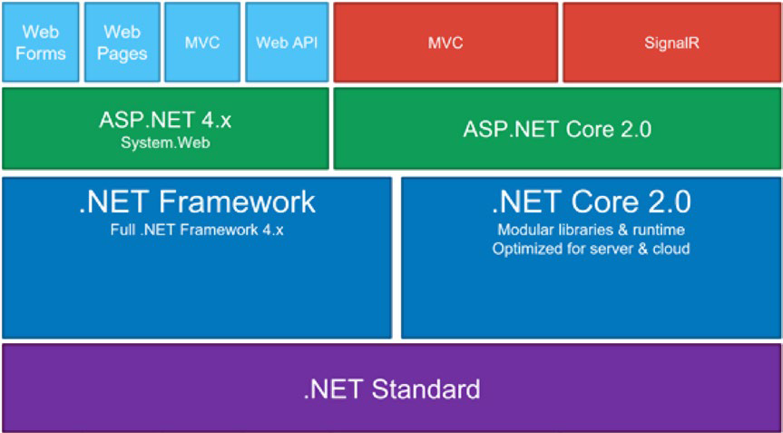
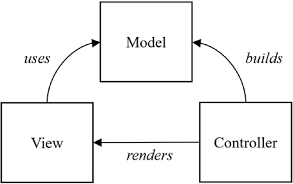
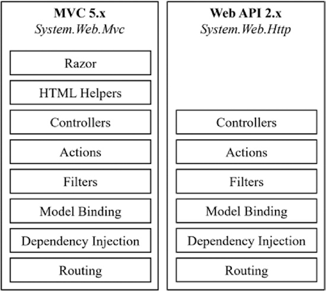
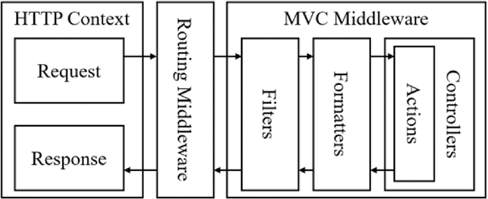

# .NET Core web api

## .NET Ecosystem


## ASP.NET Feature
* Hosting
* Middleware
* Dependency Injection
* MVC Framework
* Configuration

## .NET Core CLI
`$ dotnet new sln -n AwesomeSauce`

`$ dotnet new webapi -n AwesomeSauce.Api`

`$ dotnet sln add AwesomeSauce.Api\AwesomeSauce.Api`

`$ dotnet restore, dotnet build, and dotnet run`

## Application Start Up

In the `ConfigureServices` method, all the application-level dependencies are
registered inside the default `IoC container` by adding them to an `IServiceCollection`.

The runtime requires the specified startup class
to contain two public functions, namely `ConfigureServices`, which is optional, and `Configure`, which is compulsory. For example, let’s say that the startup class is defined
as `UseStartup<`Foo`>()`; the structure of Foo should match the following:
> Startup.cs file has default class Startup
```c#
public class Foo
{
    //optional
    public void ConfigureServices(IServiceCollection services)
    {
        services.AddRouting();
    }
    //required
    public void Configure(IApplicationBuilder app)
    {


        app.UseNumberChecker(); // MiddleWare
        
        app.UseRouter(...);
        
        app.Run(async (context) =>{
            
        });
    }
}
```

## MVC
Controllers are the main entry point and handle requests initiated from user interaction. 

Logic is performed from within the controller, and then it potentially creates a model, which houses the state of the application and the business logic around it. 

The model is then passed by the controller to a view, which has the responsibility of rendering a user interface, possibly containing the data from the model.



### A component comparison between ASP.NET MVC 5.x and ASP.NET Web API 2.x



## Controller And Action


## Configuration Model

>Don’t code hard, hardcode instead
