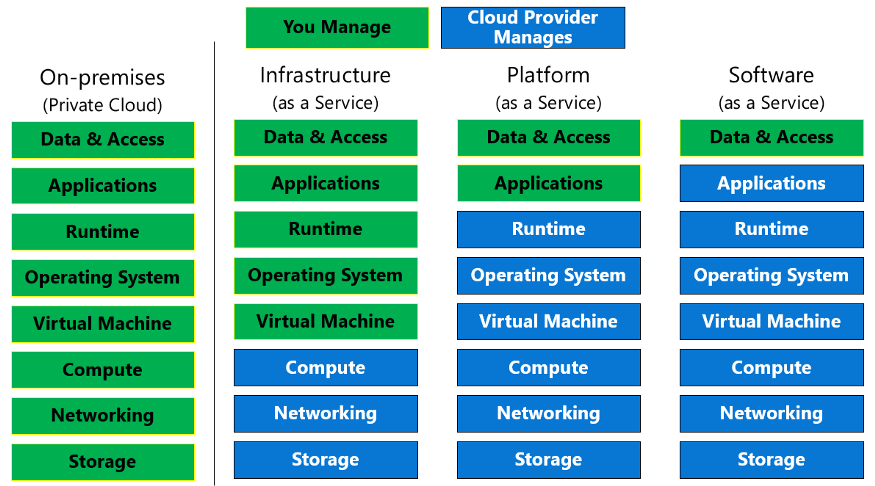

# .NET Lead Technical

## New Relic - optimize web application performance
 

## Strong expertise in SQL programming, 
	writing & optimizing queries that 
	access/process millions of records
[SQL Notes](sql)
	
## IIS configuration
	NA

## Build and Release, Agile processes, Estimation/Planning
### Scrum
	Scrum planned cannot be reverted
### XP Xtreme programming
	Priortize with shorter release cycle (Redmine)
### Kanban
	Visual of workflow
### Lean
	NA
### Pair programming
	Two developers works at one computer
## Cloud

### IaaS
	Servers, 
	storage, and 
	networking
	E.g - AWS, AZURE 
### SaaS platform 
	
	 
	Automatic data backups are built into the SaaS architecture.\
	vendor manages all backend infrastructure
	do not have to build additional tools to ensure compliance.
	SaaS architecture components are built for scalability. 
	Updating application is easy
        Atlassian saas design 
[youtube](https://youtu.be/0N4KknY_zdU)
