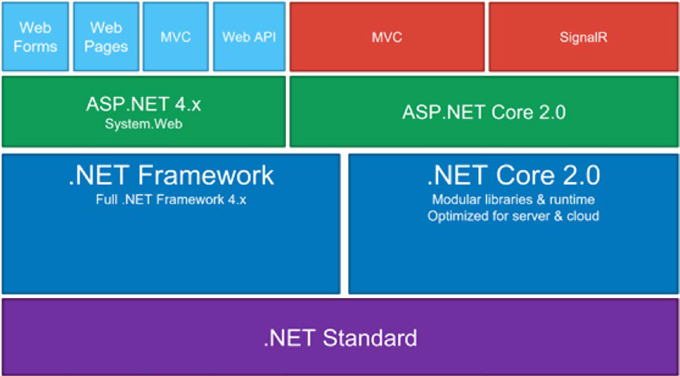
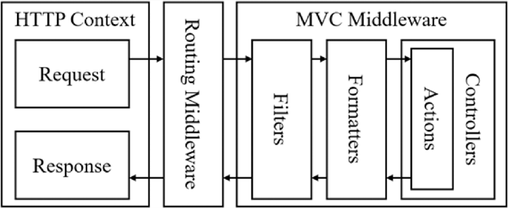

# .NET Core web api

## .NET Ecosystem


## ASP.NET Feature
* Hosting
* Middleware
* Dependency Injection
* MVC Framework
* Configuration

## .NET Core CLI
`$ dotnet new sln -n AwesomeSauce`

`$ dotnet new webapi -n AwesomeSauce.Api`

`$ dotnet sln add AwesomeSauce.Api\AwesomeSauce.Api`

`$ dotnet restore, dotnet build, and dotnet run`

## Application Start Up

In the `ConfigureServices` method, all the application-level dependencies are
registered inside the default `IoC container` by adding them to an `IServiceCollection`.

The runtime requires the specified startup class
to contain two public functions, namely `ConfigureServices`, which is optional, and `Configure`, which is compulsory. For example, let’s say that the startup class is defined
as `UseStartup<`Foo`>()`; the structure of Foo should match the following:
> Startup.cs file has default class Startup
```c#
public class Foo
{
    //optional
    public void ConfigureServices(IServiceCollection services)
    {
        services.AddRouting();
    }
    //required
    public void Configure(IApplicationBuilder app)
    {


        app.UseNumberChecker(); // MiddleWare
        
        app.UseRouter(...);
        
        app.Run(async (context) =>{
            
        });
    }
}
```

## MVC
Controllers are the main entry point and handle requests initiated from user interaction. 

Logic is performed from within the controller, and then it potentially creates a model, which houses the state of the application and the business logic around it. 

The model is then passed by the controller to a view, which has the responsibility of rendering a user interface, possibly containing the data from the model.


### A component comparison between ASP.NET MVC 5.x and ASP.NET Web API 2.x


## Controller And Action


## Configuration Model

>Don’t code hard, hardcode instead

## Prevent Cross-Site Scripting (XSS) in ASP.NET Core
>XSS vulnerabilities generally occur when an application takes user input and outputs it to a page without validating, encoding or escaping it.

## Dynamic filtering
```c#
using System.Linq.Expressions;
using Query;

var userViewDto = new List<User>
{
    new() { Id = "s0", FirstName = "sunny", LastName = "singh", Department = new Department { Id = "IT_01", Name = "IT" } },
    new() { Id = "s1", FirstName = "sunny", LastName = "raj", Department = new Department { Id = "IT_01", Name = "CA" } },
    new() { Id = "s2", FirstName = "sunny", LastName = "kumar", Department = new Department { Id = "IT_01", Name = "IB" } }
};

// Filter data structure
var filters = new List<Filter>
{ 
    new Filter { Name="FirstName", Value="sunny", Operand="and"},
    new Filter { Name="Department.Name", Value="CA", Operand=""},
    new Filter { Name="LastName", Value="raj", Operand=""},
        
};


var filterExpression = QueryBuilder.CreateFilterExpression<User>(filters);
var filterQuery = filterExpression.Compile();
var result2 = userViewDto.Where(filterQuery).FirstOrDefault();

Console.WriteLine($"{result2?.Id}");

Console.WriteLine("App closed.");

namespace Query
{
    public static class QueryBuilder
    {
        public static Expression<Func<T, bool>> CreateFilterExpression<T>(List<Filter> filters)
        {
            var param = Expression.Parameter(typeof(T), "p");
            Expression? body = null;
            foreach (Filter filter in filters)
            {
                MemberExpression? key;
                try
                {
                    key = Expression.Property(param, filter.Name!);
                }
                catch
                {
                    Expression childParam = param;
                    foreach (var member in filter.Name!.Split('.'))
                    {
                        childParam = Expression.PropertyOrField(childParam, member);
                    }
                    key = childParam as MemberExpression;
                }
                var value = Expression.Constant(filter.Value);
                var expression = Expression.Equal(key!, value);

                body = body == null ? expression : Expression.AndAlso(body, expression);
            }
            return Expression.Lambda<Func<T, bool>>(body!, param);
        }
    }
    public class User
    {
        public string? Id { get; set; }
        public string? FirstName { get; set; }
        public string? LastName { get; set; }
        public Department? Department { get; set; }
    }
    public class Department
    {
        public string? Id { get; set; }
        public string? Name { get; set; }
    }
    public class Filter
    {
        public string? Name { get; set; }
        public string? Value { get; set; }
        public string? Operand { get; set; }
    }
}
```
