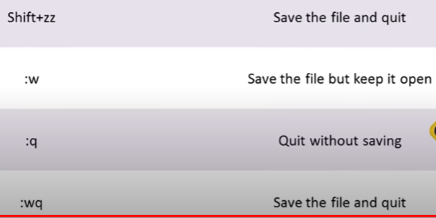
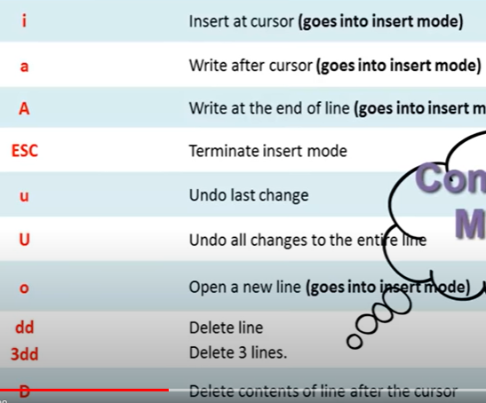

# Linux Commands 

## Cron jobs
> `crontab -e` (edit file)

> `* * * * * echo "hello sunny" >> ~/logfile.log 2>&1` (format mm hh day_of_month month day_of_week)

> tail /var/log/cron

## Linux service

> `systemctl` to view list of services running

> press `ctrl+c` to exit

> `systemctl restart httpd.service` to restart service

> systemctl list-units --type=service ( `| grep` svcname)

> du -shc /folder/* (h - human readable, c - file size, s - subfolder)

## Edit php.ini

> go to root `cd /` (for home `cd ~`)

> cd `etc`

> `vi php.ini`

> press `i` for inserting elements

> press `Esc` for inserting

> press `:wq` for saving and quiting 

## Share Windows file to linux machine or Vice Versa

### Install two packages

> sudo apt-get install `smbclient` (use yum for centOS)

> sudo apt-get install `samba` (use yum for centOS)

> sudo apt-get install `cifs-utils`

### Create mount dir for folder shared on windows

> mkdir /mnt/sunny-win-share

> mount -t cisf -o username=sunny.singh,password=ep //windowsserver/share-folder-name /mnt/sunny-win-share

> vi /etc/mtab (view mount folders path)

> `umount` //windowsserver/share-folder-name (check umount spell)

### Share Linux folder
Edit smb.conf file
> vi /etc/samba/smb.conf

```
[global]
    workgroup = SAMBA
    netbios name = myserver
    security = user

    passdb backend = tbdsam

    ntlm auth = yes
    lanman auth = no
    client lanman auth = no
    preferred masater = yes
    wins support = yes
    local master = yes
    os level = 20
    auto services = global

[SunnyShare]
    valid users = root
    path = /samba/SunnyShare
    writable = yes
    browsable = yes
```
Save changes to conf file

> chmod 777 /samba/SunnyShare

> chcon -t samba_share_t -R /samba/SunnyShare (-R used for recursive file share)

> smbpasswd -a root

> testparm (test config file)

> systemctl start smb.service (or restart)

> firewall-cmd --permanent --add-service=samba

> firewall-cmd --reload

## Firewall cmd

> firewall-cmd --list-service

> firewall-cmd --list-port

LinuxCommands | Usage
--------| -----
`awk`    | extract and transform data from field-delimited data using simple operators and regular expressions
`apt-get` or `yum` or `dnf` or `pacman`| handle packages
`bc`     | calculator
`cd`     |
`cat`    |
`chmod`  |
`chown`  | change the owner and group owner of a file.
`clear`  |
`cut`    | slice data at character positions (and a simpler field based )`cp` or `cv` copy or move
`composer`| handle php packages
`ctags`   | Makes it easy to navigate large source code projects.Tagging your code enables editors like vi and Emacs to treat your code like hypertext. Each object in your code becomes hyperlinked to its definition.
`diff`   | find the difference between two files.
`date`   |
`df`     | shows the size, used space, and available space on the mounted filesystems of your computer. `df h x squashfs`
`docker` | handle docker resources
`du`     |
`echo`   |
`exit`   | close the terminal
`free`   | `free -h` or `free -m` summary of memory usage.
`find`   |
`file`   | The file command is used to determine a file's type, regardless of its name.
`fuser`  | fuser is a mnemonic for file user and tells you what processes have opened a given file. It is used to find which process is using a file, a directory or a socket. It also gives information about the user owning the process and the type of access. It can also send a signal to all those processes for you.
`grep`   | extract data from files/input streams using regular expressions. `pgrep` Look up or signal processes based on name and other
`gem`    | handle ruby packages
`gzip`   |
`gunzip` |
`gcc`    | compiles multiple languages (C, C++, Objective-C, Ada, FORTRAN, and Java) to machine code.
`gdb`    | GDB (GNU DeBugger), enables you to step through the execution of a program 
`head`   | listing of the first 10 lines of a file
`hostnamectl` | command Use hostnamectl command to query and change the system hostname and related settings. Just type the following command to check OS name and Linux kernel version.
`history`| previously issued command.
`htop`   | granted top is the basic command and htop is an add-on, but how better do you check running processes, memory, and cpu via command line?
`ifconfig`|check/set your network interfaces
`iptables`| network traffic rules
`kill -9`|
`logout` |
`ls`     |
`lscpu`  | The lscpu command reports information about the cpu and processing units.
`lsusb`  | list usb buses and device details.
`lshw`   | A general purpose utility, that reports detailed and brief information about multiple different hardware units such as cpu, memory disk, usb controllers, network adapters etc. Lshw extracts the information from different /proc files.
`ln`     |
`less`   | read big size files. Use left right arrow and page up and down press `Q` to quit. Use `/` to search forward in the file and use `?` to search backward.
`locate` | quick searching of local disks?
`man`    | (manual)instruction on how to use a command. e.g `man ls`.
`mv`     |
`more`   |
`mkdir`  |
`npm`    |
`nslookup` | We take DNS for granted, but try to do some low-level DNS debugging without access to public Internet tools
`nm`     | The nm command enables you to retrieve information on symbol names inside an object file or executable file.
`od`     | The od command is used to convert a binary file to whatever format you like. Is is used for displaying ("dumping") data in various human-readable output formats. Although the name stands for octal dump, it can dump data in decimal and hexadecimal as well.
`objdump`| The objdump is sort of a data-mining tool for object files. It can be used as a disassembler to view an executable in assembly form.
`ping`    |
`poweroff`| 
`passwd`  |
`pwd`     | present working directory
`ps`      | ps is used to find process status. Commonly used in conjunction with the grep command and the more or less commands. It lets you access many details of your processes, including CPU usage, virtual memory usage, current state and much more. e.g `ps -e | grep shutter.`. `ps -u dave | less`. `ps -e | less`
`pip`    | to install python packages
`route`  | network routing
`reboot`|
`rpm`    | look for all software install `rpm -qa | less`
`rm`     | remove file or `-R` remove folder 
`stat`   | info about file
`sort`   |
`scp`    |
`sftp`   |
`sudo`   | admin power
`strings`| The strings command looks for ASCII strings embedded in binary files.
`screen` | multiple console sessions, very useful over SSH, for instance.
`strace` | strace enables you to decipher what's going on when you have no debugger nor the source code. Lets you to see which system calls a particular user application is hitting, the arguments passed passed in, and the return values. strace also lets you attach to processes for just-in-time debugging.
`ssh`    | work with remote server
`tail`   | listing of the last 10 lines of a file.
`top`    | see what process is killing my server now
`tar`    | to zip: `tar -cvf songs.tar FolderPath/` or `tar -cvzf songs.tar.gz sunnysinghdev/` or  or `tar -cvjf songs.tar.bz2 sunnysinghdev/`.unzip `tar -xvf songs.tar`. Params `-c` (create) option,the `-v` (verbose), `-f` (filename) option, `-x` (extract) option, `-z` (gzip) option and , `-z` (bzip2) option  
`touch`  |
`traceroute`| another networking must. Need to know the physical route of your packet from point A to point B
`time`   | The time command is used to determine the duration of execution of another particular command and can be useful for understanding your code's performance.
`uniq -c`| group data and report on number of occurrences
`uname`  |
`whois` | third party
`which`|
`w`      |The w command lists the currently logged in users.
`wget` or `curl`| download
`>` or `>>` | so you can send a string to a file on the fly without using editor
`vi` or `nano` | an editor so you can edit a file.
`./` | so you can execute a file into an action.

## CHMOD File permissions

>0: No permission

>1: Execute permission

>2: Write permission

>3: Write and execute permissions

>4: Read permission

>5: Read and execute permissions

>6: Read and write permissions

>7: Read, write and execute permissions

## uname
You can obtain some system information regarding the Linux computer you’re working on with the `uname` command.

* Use the -a (all) option to see everything.
* Use the -s (kernel name) option to see the type of kernel.
* Use the -r (kernel release) option to see the kernel release.
* Use the -v (kernel version) option to see the kernel version.

## top
The `top` command shows you a real-time display of the data relating to your Linux machine. The top of the screen is a status summary.

The first line shows you the time and how long your computer has been running for, how many users are logged into it, and what the load average has been over the past one, five, and fifteen minutes.

The second line shows the number of tasks and their states: running, stopped, sleeping and zombie.

The third line shows CPU information. Here’s what the fields mean:

* us: value is the CPU time the CPU spends executing processes for users, in “user space”
* sy: value is the CPU time spent on running system “kernel space” processes
* ni: value is the CPU time spent on executing processes with a manually set nice value
* id: is the amount of CPU idle time
* wa: value is the time the CPU spends waiting for I/O to complete
* hi: The CPU time spent servicing hardware interrupts
* si: The CPU time spent servicing software interrupts
* st: The CPU time lost due to running virtual machines (“steal time”)

The fourth line shows the total amount of physical memory, and how much is free, used and buffered or cached.

The fifth line shows the total amount of swap memory, and how much is free, used and available  (taking into account memory that is expected to be recoverable from caches).


### The columns in the main display are made up of:
* PID: Process ID
* USER: Name of the owner of the process
* PR: Process priority
* NI: The nice value of the process
* VIRT: Virtual memory used by the process
* RES: Resident memory used by the process
* SHR: Shared memory used by the process
* S: Status of the process. See the list below of the values this field can take
* %CPU: the share of CPU time used by the process since last update
* %MEM: share of physical memory used
* TIME+: total CPU time used by the task in hundredths of a second
* COMMAND: command name or command line (name + options)

### The status of the process can be one of:

* D: Uninterruptible sleep
* R: Running
* S: Sleeping
* T: Traced (stopped)
* Z: Zombie

>Press the Q key to exit from top.
## vi editor cmd

>`:$` (move to end of file)



## Other things to know
>`alias pf="ps -e | grep $1"` alias for geeting procees id

>`Ctrl+Shift+C` for copy and `Ctrl+Shift+V` for paste 

>`ssh` sunny@192.168.40.1. ``

>`:earlier 15m` Reverts the document back to how it was 15 minutes ago

>`:w !sudo tee %` forget to sudo before editing a file.

>`find -name find -name test.txt`

>`grep -Pri Search_Term path_to_directory` Find if there are files containing a particular text

>`> filename` Empty a file without deleting it

>`yes | command_or_script` Using yes command for commands or scripts that need interactive response

>`alias gerp=grep` provide alternate name for a command.

> Press `ctrl+Q` to unfreeze terminal, when `ctrl+S` get pressed

>`whoami` know the current user

>`id`

> the current directory, represented by the single `.` character.

>`sudo su -` switch user to root 

>`ls la` show permission

>`fdisk -l` *xvd*  hard drive format disk

>`/etc/user` displays all group

>`/etc/passwd` User:/home/user: /bin/bash is a shell

>`grep bash /etc/paswwd` list all user having access to bash

>`id user`

>`visudo` 

>`less /etc/sudoers`

>`useradd vivek`
>`password ****`

>`vi /etc/ssh/sssd-config` 

>`service sshd restart`

>`ssh-keygen -t rsa` creates public key private key


  
Author 
[sunnysinghdev](http:github.com/sunnysinghdev)